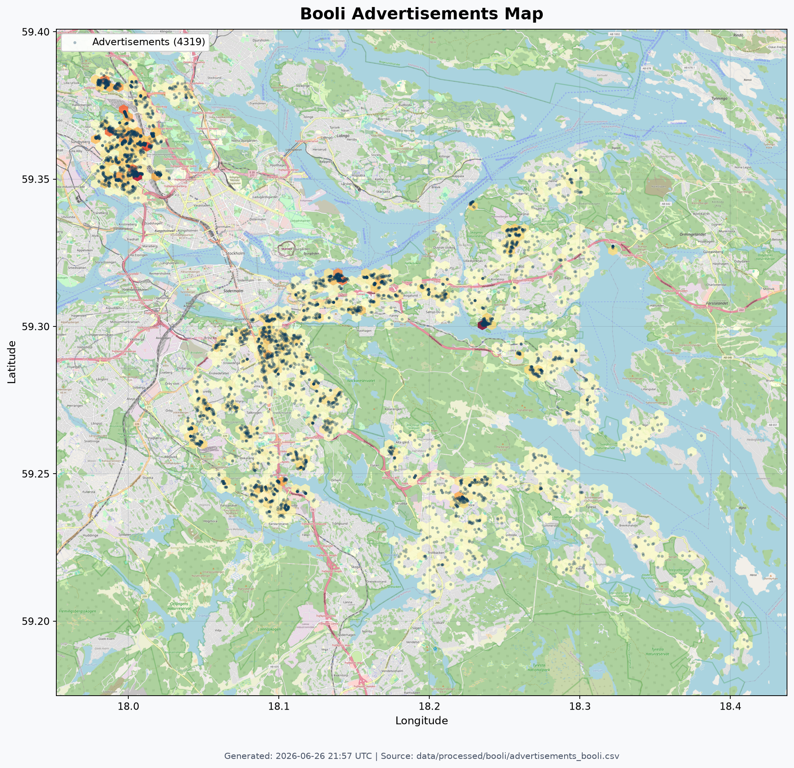

# Geographic coverage

The service does **not** cover all of Sweden. Coverage is currently limited to
**selected kommuner in the Stockholm region**, and grows over time as new areas
are imported.



## Currently covered

| Kommun | Scope |
| --- | --- |
| Stockholm | Two circular areas only — one around the inner city, one over Söderort (the southern suburbs); not the whole kommun |
| Solna | Whole kommun |
| Nacka | Whole kommun |
| Tyresö | Whole kommun |

The authoritative, always-current list is the live API itself:

```http
GET /kommuns
```

returns every kommun present in the data (with per-kommun statistics). Treat
that endpoint — not this page — as ground truth when querying.

## Data completeness within covered areas

Coverage of an area does not mean every field is filled. The main known gap is
the **monthly fee (avgift) on sold apartments**, which is backfilled
progressively per kommun: Solna and Tyresö are essentially complete (~98% of
sold bostadsrätt), while Nacka (~46%) and Stockholm (~21%) are still partial,
with recent sales prioritized. Fee-derived statistics (e.g. fee trends) are
correspondingly noisier for Stockholm and Nacka until the backfill completes —
see the changelog's *Known limitations* for current status.

## Interpreting empty results

If you query a kommun or area that is not covered, the API returns an empty
result set — **an empty answer means "outside coverage", not "no such
properties exist"**. Before concluding anything from an empty response, check
`GET /kommuns` (and `GET /areas?kommun=<Name>`) to confirm the location is in
the dataset.

## Expansion

More kommuner are imported over time. Additions are announced in the
[changelog](./CHANGELOG.md) and reflected immediately in `GET /kommuns` and on
the map above.
